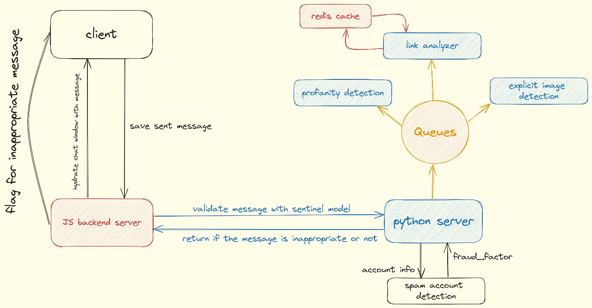

## Sentinel

Sentinel is an advanced safety platform designed to protect children in online communication environments. This repository hosts the source code and documentation for our comprehensive safety solution.
Features


## Problem Statement

- In today's digital age, children are increasingly exposed
to online communication platforms where they can interact
with others through chats and messages.

- However, this virtual environment comes with inherent
risks, including exposure to profanity and inappropriate
language.

- The lack of effective tools to monitor and filter out such
language poses a significant threat to children's safety
and well-being.

- Without adequate safeguards in place, children may be
subjected to harmful content that can negatively impact
their emotional and psychological development.

| | | |
|:-------------------------:|:-------------------------:|:-------------------------:|
||  ||

## Solution 
Sentinel is not just another chat application; it's a comprehensive safety platform meticulously designed to enhance the security of children in online communication environments. It's important to note that Sentinel is not meant to replace or compete with existing chat or social media platforms. Instead, it serves as a vital addition to these spaces, providing an extra layer of protection and safety measures. By seamlessly integrating into various chat and social media rooms, Sentinel aims to augment the safety standards of these platforms, ensuring that children can interact online with reduced exposure to inappropriate content and potential risks

### Features implemented

- **Real-time Chat Monitoring:** Monitors chat conversations in real-time for inappropriate content, uses queues to parallely compute input, reducing inference time tremendously.

- **Multiplatform Integration:** Seamless integration with chat platforms used by children, effective in various digital environments.

- **Profanity Detection:** Utilizes Named Entity Recognition for identifying personal information and flagging instances of profanity.

- **Link Analysis:** Scans URLs within chat messages for signs of suspicious or malicious content.

- **Explicit Image Detection:** Filters images containing nudity, violence, or graphic imagery.

- **Spam/Fraud Account Detection:** Identifies and mitigates deceptive practices such as spamming and fraudulent account creation.

- **Document Analysis:** Phrases Documents to detect profanity and explicit content.



### Future Prospects
- **MultiLingual Support**
- **Speech Processing**
- **Federated Learning**

### Tech Stack

<p>
  
  
  
  
  
  
  
  
</p>

### Running Locally

- This repo is split into 3 parts - the chat frontend, the chat backend and the python server

```bash
git clone https://github.com/vaibhavraj-exe/sentinel
cd sentinel
```

#### Running the python server
- Install [Erlang](https://www.erlang.org/)
- Install [RabbitMQ](https://www.rabbitmq.com/docs/install-windows)
- - Run RabbitMQ after it gets installed
```bash
cd server/services
pip install -r requirements.txt

uvicorn server:app --host=0.0.0.0 --port=8000

# create another terminal
cd models/link_detection
python main.py

# create another terminal
cd models/video_detection
python main.py

# create another terminal
cd models/profanity_detection
python main.py
```

```bash
# Install nodejs beforehand
```

#### Running the chat-app frontend
```bash
cd chat/frontend
npm i
npm run build
npm start
```

#### Running the chat-app backend
```bash
cd chat/backend
npm i
node .
```

### Business model


As a Software as a Service (SaaS) solution, Sentinel offers a subscription-based model targeting Big Tech Companies with already existing large platforms, enabling them to enhance the safety and security of their platforms. By investing in Sentinel, these companies demonstrate their commitment to providing a safer online environment for their users, while parents gain peace of mind knowing that their children are better protected from harmful content.

- Big Tech Companies: Companies that implement
communication channels, eg: instagram, Discord

- Developers: People implementing the service into their
application.

- Parents & Children: parents allowing their kids access to these channels and children utilizing them

### Demo Videos
- A chat app from future

https://github.com/vaibhavraj-exe/sentinel/assets/85381117/bf27f1f9-90ac-48a7-82b2-603c951906b0

- Keeps children safe with AI based text filter

https://github.com/vaibhavraj-exe/sentinel/assets/85381117/c2b7e33d-573f-40ed-8514-8d05c181252c

- Blocked keywords provide extra layer of security

https://github.com/vaibhavraj-exe/sentinel/assets/85381117/f0e90b4c-36e5-4006-b2ad-7da028b18892

- Image and document profanity detection for safe media sharing

https://github.com/vaibhavraj-exe/sentinel/assets/85381117/b94ea8a1-f171-4b88-8ecb-c18a9d78e7e6

https://github.com/vaibhavraj-exe/sentinel/assets/85381117/20805668-5a30-4364-9439-835ee662eb2a

- Safe live video calling

https://github.com/vaibhavraj-exe/sentinel/assets/85381117/35fd8a28-6140-453c-8303-f200879e60ed

- Score based system, accounts with score lower than thresold get flagged


- AI based appeal system

https://github.com/vaibhavraj-exe/sentinel/assets/85381117/96c4df18-2973-4733-a9cf-9c41142d5f98


